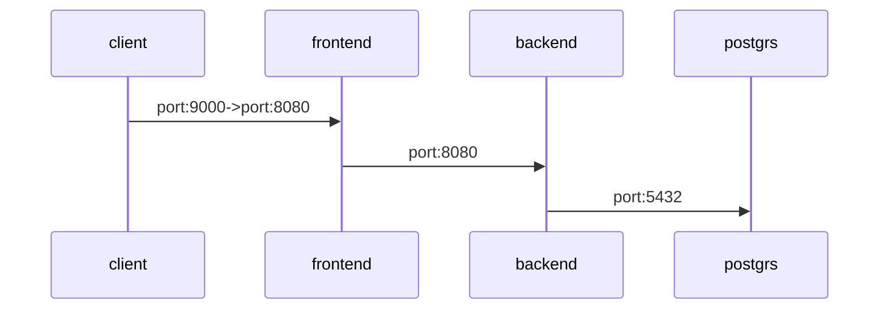

# 概要
## 構成
- コンテナ：frontend
- コンテナ：backend
- コンテナ：postgres

```mermaid
sequenceDiagram
    client ->> frontend:port:9000->port:8080
    frontend ->> backend:port:8080
    backend ->> postgrs:port:5432
```

## 起動方法
- docker-compose up

## アクセス方法
`http://localhost:8080/`
→ 自動的に`http://localhost:8080/cafelog/login` にリダイレクトされる

